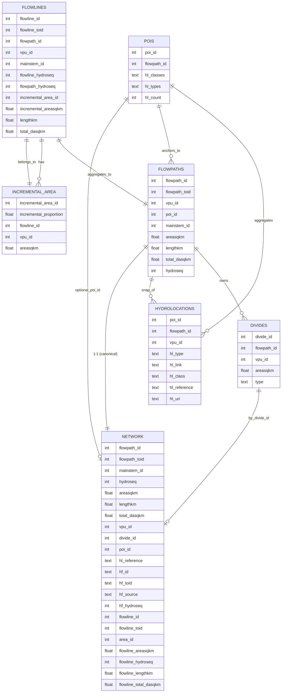

# Lynker Hydrofabric Data Model

> **Scope:** Core entities and relationships for flowpath analysis, catchment aggregation, and POI integration.

## Overview
This model defines five entities—**Flowpaths**, **Divides**, **Network**, **POIs**, and **Hydrolocations**—used to represent a hydrologic network with topological connectivity, catchment areas, and crosswalks to external points of interest.

---

## Table Descriptions

**Flowpaths** — The canonical, directed reach segments of the _hydrologic_ network. Each record represents a routed centerline with a downstream pointer (`flowpath_toid`). Flowpaths carry network metrics (length, drainage area at outlet, hydrosequence), belong to a `vpu_id` tile, can be grouped into `mainstem_id`, and optionally anchor a `poi_id`. Each flowpath is associated with one divide polygon that approximates its incremental catchment.

**Divides** — Polygonal catchments associated to flowpaths. Divides store area (`areasqkm`), tiling (`vpu_id`), and a categorical `type` (e.g., `network`, `coastal`, `internal`). In most datasets there is a one‑to‑one relationship between `divide_id` and `flowpath_id` (generalization may introduce one‑to‑many).

**POIs** — Logical points of interest used as named anchors and aggregation nodes (e.g., gauges, reservoirs, confluences). POIs are snapped to a `flowpath_id` for routing and aggregate one or more **Hydrolocations**; rollup columns summarize the attached hydrolocations via `hl_types` (sources) and `hl_classes` (semantics) with a count in `hl_count`.

**Hydrolocations** — Individual features coming from external source systems (e.g., NWIS, HUC12, NBI, HiLARRI) that have been snapped to the network. Each record has a source `hl_type`, a native key `hl_link`, a semantic class `hl_class` (e.g., `gage`, `reservoir`), and a unique cross‑system `hl_reference` (recommended `{hl_type}-{hl_link}`), plus an optional `hl_uri` when a web resource exists. Hydrolocations group to a POI (`poi_id`) and also retain their snapped `flowpath_id`.

**Network** — A denormalized, read‑optimized view that combines common flowpath, divide, POI, hydrolocation, and external Hydrofabric identifiers. It mirrors the flowpath topology (`flowpath_id`/`flowpath_toid`, `hydroseq`) and exposes convenient crosswalks (`hl_reference`, `hf_*`) and flowline‑granularity metrics, enabling fast queries without multiple joins.

---

## Entities & Attributes

### Flowpaths
| Column           | Type   | Description                                                                 |
|------------------|--------|-----------------------------------------------------------------------------|
| `flowpath_id`    | int    | Primary key for the flowpath.                                               |
| `flowpath_toid`  | int    | Downstream `flowpath_id` (self-reference); NULL for terminal reaches.       |
| `vpu_id`         | int    | Vector Processing Unit identifier (processing/tiling key).                  |
| `poi_id`         | int    | Optional anchoring POI on this flowpath (if any).                           |
| `mainstem_id`    | int    | Identifier grouping flowpaths that belong to the same mainstem.             |
| `areasqkm`       | float  | Area of the associated divide/catchment in square kilometers.               |
| `lengthkm`       | float  | Flowpath length (km).                                                       |
| `total_dasqkm`   | float  | Total contributing drainage area at the downstream end (sq km).             |
| `hydroseq`       | int    | Topological order for deterministic traversal (larger = more upstream).     |

---

### Divides
| Column        | Type   | Description                                                                 |
|---------------|--------|-----------------------------------------------------------------------------|
| `divide_id`   | int    | Primary key for the divide/catchment polygon.                               |
| `flowpath_id` | int    | The owning `flowpath_id` (one-to-one or one-to-many by generalization).     |
| `vpu_id`      | int    | Vector Processing Unit identifier.                                          |
| `areasqkm`    | float  | Divide/catchment area (sq km).                                              |
| `type`        | text   | Category of divide (e.g., `network`, `coastal`, `internal`).                |

---

### POIs
| Column         | Type | Description                                                                 |
|----------------|------|-----------------------------------------------------------------------------|
| `poi_id`       | int  | Primary key for a Point of Interest (gauge, dam, confluence, etc.).         |
| `flowpath_id`  | int  | Flowpath this POI is snapped/anchored to (for routing/crosswalk).           |
| `hl_classes`   | text | Comma-separated list of hydrolocation **classes** (e.g., `gage,reservoir`). |
| `hl_types`     | text | Comma-separated list of hydrolocation **source types** (e.g., `nwis,huc12`).|
| `hl_count`     | int  | Count of hydrolocations aggregated to this POI.                             |

---

### Hydrolocations
| Column          | Type  | Description                                                                                      |
|-----------------|-------|--------------------------------------------------------------------------------------------------|
| `poi_id`        | int   | Foreign key to `POIs.poi_id`.                                                                    |
| `flowpath_id`   | int   | Flowpath to which this hydrolocation is snapped (can differ from POI anchor if needed).          |
| `vpu_id`        | int   | Vector Processing Unit identifier.                                                               |
| `hl_type`       | text  | **Source/dataset type** (formerly `hl_source`), e.g., `nwis`, `huc12`, `nbi`, `hilarri`.         |
| `hl_link`       | text  | Native identifier/key in the source system specified by `hl_type`.                               |
| `hl_class`      | text  | **Semantic class** (formerly `hl_type`), e.g., `gage`, `reservoir`, `lake`, `confluence`.        |
| `hl_reference`  | text  | Stable cross-system key, recommended format `{hl_type}-{hl_link}`; unique across the model.      |
| `hl_uri`        | text  | Optional resolvable URI to the web resource for the hydrolocation (if available).                |

> Applied TODO: removed `hl_id`; renamed `hl_source → hl_type` and `hl_type → hl_class`.

---

### Network
| Column                  | Type   | Description                                                                 |
|-------------------------|--------|-----------------------------------------------------------------------------|
| `flowpath_id`           | int    | Primary key; FK → `flowpaths.flowpath_id`.                                  |
| `flowpath_toid`         | int    | Downstream `flowpath_id`.                                                   |
| `mainstem_id`           | int    | Mainstem grouping id.                                                       |
| `hydroseq`              | int    | Flowpath hydrosequence.                                                     |
| `areasqkm`              | float  | Associated divide area (sq km).                                             |
| `lengthkm`              | float  | Flowpath length (km).                                                       |
| `total_dasqkm`          | float  | Total contributing drainage area at outlet (sq km).                         |
| `vpu_id`                | int    | Vector Processing Unit identifier.                                          |
| `divide_id`             | int    | FK → `divides.divide_id`.                                                   |
| `poi_id`                | int    | Optional FK → `pois.poi_id` (if a POI directly attaches to this flowpath).  |
| `hl_reference`          | text   | Optional crosswalk to a specific hydrolocation (if directly linked).        |
| `hf_id`                 | text   | External Hydrofabric flowpath id (if present).                              |
| `hf_toid`               | text   | External Hydrofabric downstream id (if present).                            |
| `hf_source`             | text   | Source label for `hf_*` ids (e.g., `lynker`, `nhdplusv2`, `merit`).         |
| `hf_hydroseq`           | int    | External Hydrofabric hydrosequence (if provided).                           |
| `flowline_id`           | int    | Underlying flowline id (if flowpath aggregates multiple flowlines).         |
| `flowline_toid`         | int    | Downstream flowline id.                                                     |
| `area_id`               | int    | Underlying area/catchment id for the flowline (if distinct).                |
| `flowline_areasqkm`     | float  | Catchment area (sq km) for the underlying flowline.                         |
| `flowline_hydroseq`     | int    | Hydrosequence at the flowline granularity.                                  |
| `flowline_lengthkm`     | float  | Flowline length (km).                                                       |
| `flowline_total_dasqkm` | float  | Total contributing drainage area at the flowline outlet (sq km).            |

---

### Flowlines
| Column               | Type   | Description                                                                 |
|----------------------|--------|-----------------------------------------------------------------------------|
| `flowline_id`        | int    | Unique identifier for the underlying fine‑scale flowline segment.           |
| `flowline_toid`      | int    | Identifier of the immediate downstream flowline segment.                    |
| `flowpath_id`        | int    | Reference to the aggregated flowpath that this flowline contributes to.     |
| `vpu_id`             | int    | Vector Processing Unit identifier (tiling key for processing).              |
| `mainstem_id`        | int    | Identifier grouping flowlines/flowpaths into a common mainstem.             |
| `flowline_hydroseq`  | int    | Hydrosequence order at the flowline granularity (higher = more upstream).   |
| `flowpath_hydroseq`  | int    | Hydrosequence order of the parent flowpath.                                 |
| `incremental_area_id`| int    | Identifier for the incremental catchment polygon associated with the flowline. |
| `incremental_areasqkm`| float | Incremental catchment area draining directly to this flowline (sq km).      |
| `lengthkm`           | float  | Length of the flowline segment in kilometers.                               |
| `total_dasqkm`       | float  | Total contributing drainage area accumulated at the downstream end (sq km). |

--- 

### Incremental Area
| Column                   | Type   | Description                                                                 |
|--------------------------|--------|-----------------------------------------------------------------------------|
| `incremental_area_id`    | int    | Unique identifier for the incremental catchment polygon.                    |
| `incremental_proportion` | float  | Proportion of the incremental catchment contributing to a divide (0–1).   |
| `flowline_id`            | int    | Identifier of the flowline associated with this incremental catchment.      |
| `vpu_id`                 | int    | Vector Processing Unit identifier (tiling key for processing).              |
| `areasqkm`               | float  | Area of the incremental catchment in square kilometers.                     |

---

## Relationships (ERD)

